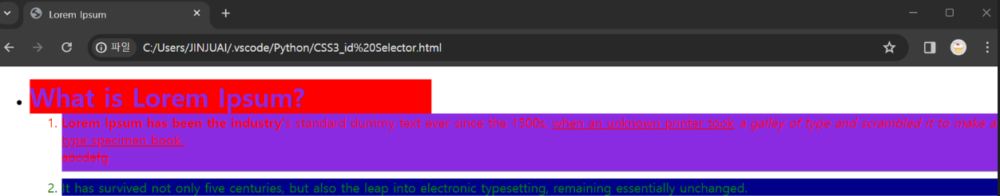
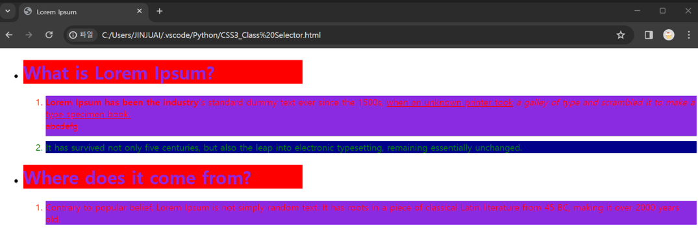
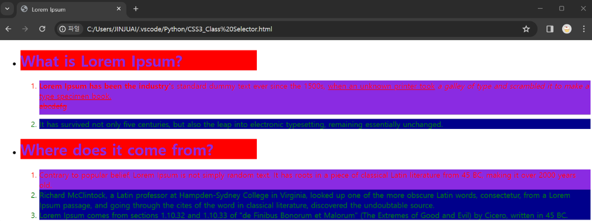

### id 선택자 : 특정 id속성이 있는 태그 선택, 웹 표준에 id속성은 규정상 웹 페이지 내부에서 중복되면 안되고 id 선택자는 특정 태그 하나를 선택할 때 사용한다.

```html
<!DOCTYPE html>
<html lang="en">

<head>
    <meta charset="UTF-8">
    <meta name="viewport" content="width=device-width, initial-scale=1.0">
    <title>Lorem Ipsum</title>
</head>
<style>
     #header {
        color: blueviolet;
        width: 500px; margin: 0;
        background-color: red;    
    }

    #content {
        color: red;
        width: 500; margin: 0;
        background-color: blueviolet;
    }

    #nextContent{
        color: green;
        width: 500; margin: 0;
        background-color: darkblue;
    }

</style>
<body>
    <ul>
        <li>
            <h1 id="header">What is Lorem Ipsum?</h1>
        </li>
        <ol>
            <li id="content">
                <b>Lorem Ipsum has been the industry'</b>s standard dummy text ever since the 1500s,
                <u>when an unknown printer took</u> <i>a galley of type and scrambled it to make a </i><ins>type specimen book.</ins>
                <br>
                <del>abcdefg</del>
                <hr>
            </li>
            <li id="nextContent">
                It has survived not only five centuries, but also the leap into electronic typesetting, remaining essentially unchanged.
            </li>
        </ol>
    </ul>
</body>
</html>
```



동일한 id선택자를 여러개 사용할 경우 CSS를 동시에 적용하기 때문에 동일한 id선택자를 최대한 피하는 것이 좋다. 

만약 CSS를 동일하게 적용시킬 목적이면 상관이 없지만 JavaScript에서는 id 속성이 문제가 발생하므로 웹 페이지 내부에서 id속성이 중복되지 않게 적용하는 것이 좋다. 

```html
**<!DOCTYPE html>
<html lang="en">

<head>
    <meta charset="UTF-8">
    <meta name="viewport" content="width=device-width, initial-scale=1.0">
    <title>Lorem Ipsum</title>
</head>
<style>

    #header {
        color: blueviolet;
        width: 500px; margin: 0;
        background-color: red;    
    }

    #content {
        color: red;
        width: 500; margin: 0;
        background-color: blueviolet;
    }

</style>
<body>
    <div>
        <h1 id="header">What is Lorem Ipsum?</h1>
    </div>
    
    <div>
        <p id = "content">
            Lorem Ipsum has been the industry's standard dummy text ever since the 1500s,
            when an unknown printer took a galley of type and scrambled it to make a type specimen book.
            It has survived not only five centuries, but also the leap into electronic typesetting, remaining essentially unchanged.
        </p>

        <p id="content">
            It was popularised in the 1960s with the release of Letraset sheets containing Lorem Ipsum passages, 
            and more recently with desktop publishing software like Aldus PageMaker including versions of Lorem Ipsum.
        </p>
    </div>
</body>
</html>**
```



### Class 선택자 : 특정 Class가 있는 태그를 선택하여 사용

```html
<!DOCTYPE html>
<html lang="en">

<head>
    <meta charset="UTF-8">
    <meta name="viewport" content="width=device-width, initial-scale=1.0">
    <title>Lorem Ipsum</title>
</head>
<style>
     #header1 {
        color: blueviolet;
        width: 500px; margin: 10;
        background-color: red;    
    }

    #content {
        color: red;
        width: 500; margin: 0;
        background-color: blueviolet;
    }

    #nextContent{
        color: green;
        width: 500; margin: 0;
        background-color: darkblue;
    }

    .header2{
        color: blueviolet;
        width: 500px; margin: 10;
        background-color: red;
    }

    .ClassContent{
        color: red;
        width: 500; margin: 0;
        background-color: blueviolet;
    }

</style>
<body>
    <ul>
        <li>
            <h1 id="header1">What is Lorem Ipsum?</h1>
        </li>
        <ol>
            <li id="content">
                <b>Lorem Ipsum has been the industry'</b>s standard dummy text ever since the 1500s,
                <u>when an unknown printer took</u> <i>a galley of type and scrambled it to make a </i><ins>type specimen book.</ins>
                <br>
                <del>abcdefg</del>
                <hr>
            </li>

            <li id="nextContent">
                It has survived not only five centuries, but also the leap into electronic typesetting, remaining essentially unchanged.
            </li>
        </ol>

        <li>
            <h1 class="header2">Where does it come from?</h1>
        </li>
        <ol>
            <li class="ClassContent">
                Contrary to popular belief, Lorem Ipsum is not simply random text. It has roots in a piece of classical Latin literature from 45 BC, making it over 2000 years old.
            </li>
        </ol>
    </ul>
    
</body>
</html>
```


Class 선택자를 여러개 사용하는 경우 띄어쓰기를 기준으로 구분하여 사용할 수 있다.

```html
<!DOCTYPE html>
<html lang="en">

<head>
    <meta charset="UTF-8">
    <meta name="viewport" content="width=device-width, initial-scale=1.0">
    <title>Lorem Ipsum</title>
</head>
<style>
     #header1 {
        color: blueviolet;
        width: 500px; margin: 10;
        background-color: red;    
    }

    #content {
        color: red;
        width: 500; margin: 0;
        background-color: blueviolet;
    }

    #nextContent{
        color: green;
        width: 500; margin: 0;
        background-color: darkblue;
    }

    .header2{
        color: blueviolet;
        width: 500px; margin: 10;
        background-color: red;
    }

    .ClassContent1{
        color: red;
        width: 500; margin: 0;
        background-color: blueviolet;
    }

    .ClassContent2{
	      color: green;
        width: 500; margin: 0;
    }

    .ClassContent3{
        background-color: darkblue;
    }

</style>
<body>
    <ul>
        <li>
            <h1 id="header1">What is Lorem Ipsum?</h1>
        </li>
        <ol>
            <li id="content">
                <b>Lorem Ipsum has been the industry'</b>s standard dummy text ever since the 1500s,
                <u>when an unknown printer took</u> <i>a galley of type and scrambled it to make a </i><ins>type specimen book.</ins>
                <br>
                <del>abcdefg</del>
                <hr>
            </li>

            <li id="nextContent">
                It has survived not only five centuries, but also the leap into electronic typesetting, remaining essentially unchanged.
            </li>
        </ol>

        <li>
            <h1 class="header2">Where does it come from?</h1>
        </li>
        <ol>
            <li class="ClassContent1">
                Contrary to popular belief, Lorem Ipsum is not simply random text. It has roots in a piece of classical Latin literature from 45 BC, making it over 2000 years old.
            </li>

            <li Class="ClassContent2 ClassContent3">
                Richard McClintock, a Latin professor at Hampden-Sydney College in Virginia, looked up one of the more obscure Latin words, consectetur, from a Lorem Ipsum passage, 
                and going through the cites of the word in classical literature, discovered the undoubtable source.
            </li>

            <li class="ClassContent2 ClassContent3">
                Lorem Ipsum comes from sections 1.10.32 and 1.10.33 of "de Finibus Bonorum et Malorum" (The Extremes of Good and Evil) by Cicero, written in 45 BC.
            </li>
        </ol>
    </ul>
    
</body>
</html>
```



### id와 class 속성의 차이점

id 속성은 전체 페이지에서 단 하나의 요소에만 지정이 가능하며 태그에 유일한 이름을 붙이고 싶을 때 사용하고 단 하나의 요소에만 쓸 수 있기 때문에 중복이 불가능하다.

class 속성은 같은 유형으로 반복되는 태그들을 유형별로 분류하고 싶을 때 사용하며 반복적으로 쓰이는 유형들을 유형별로 동일한 class로 분류하여 쉽게 관리하기 위함이고 중복이 가능하다.

적용 우선순위는 id속성이 단 하나의 요소를 쓰는 만큼 CSS에서 쓰일 때 Class보다 우선적으로 적용된다.